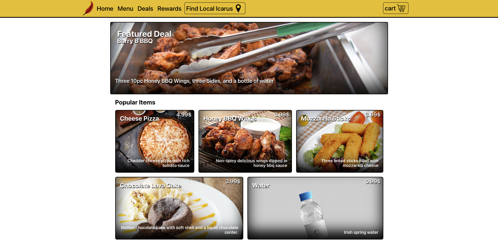

# **Icarus Pizza**

## A pizza ordering application
Icarus Pizza is a website where the user can choose pizza and/or item to add to their cart. Along with adding individual items to their cart they can also choose a deal to add multiple items in their cart for a lower price. The user can also make a personalized pizza where they can choose their own toppings, curst, and size of the pizza. They can then, if they choose, create a pizza preset which then will be added to the database of pizza presets that are created by all user. The user can choose a preset to add to their cart.

## Technology used in development
React.js | HTML/JSX | SCSS | Node.js | Mongoose | MongoDB | Express.js

## Known Issues
- Cart in nav only changes on refresh

# [**Go To Icarus Pizza**](https://icarus-pizza.vercel.app/)

